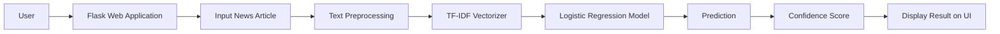

# FakeNews AI

<div align="center">
[](https://www.kaggle.com/code/mobeenfatimah/fake-news-detection-97-1-accuracy)


### AI-Powered Fake News Detection System

Detect whether a news article is **Real** or **Fake** using **Natural Language Processing (NLP)** and **Machine Learning** with a modern Flask web interface.

</div>

---

#  Overview

FakeNews AI is a machine learning web application that classifies news articles into **Real** or **Fake** using **TF-IDF Vectorization** and a **Logistic Regression** classifier.

The application provides an intuitive interface where users can paste any news article and instantly receive:

- Prediction (Real/Fake)
- Confidence Score
- Prediction History
- Fast Response Time
- Interactive UI

---

# Features

- AI-powered Fake News Detection
- News Article Classification
- Confidence Score
- Real-Time Prediction
- TF-IDF Feature Extraction
- Logistic Regression Classifier
- Text Cleaning using NLTK
- Local Prediction History
- Dark / Light Theme
- Fully Responsive Design

---

# System Architecture



---

# Workflow

```text
User
   │
   ▼
Enter News Article
   │
   ▼
Text Cleaning (NLTK)
   │
   ▼
TF-IDF Feature Extraction
   │
   ▼
Logistic Regression Prediction
   │
   ▼
Confidence Score Calculation
   │
   ▼
Display Result
```

---

# Project Structure

```
FakeNews-AI/
│
├── app.py
├── requirements.txt
├── README.md
│
├── dataset/
│   └── news_data.csv
│
├── models/
│   └── fake_news_model.pkl
│
├── src/
│   ├── preprocess.py
│   └── train_model.py
│
├── static/
│   ├── css/
│   ├── js/
│   └── images/
│
├── templates/
│   └── index.html
│
└── screenshots/
```

---

# Machine Learning Pipeline

### Text Preprocessing

- Lowercase Conversion
- Remove Punctuation
- Remove Numbers
- Remove Stopwords
- Clean Text

↓

### Feature Engineering

TF-IDF Vectorization

↓

### Classification

Logistic Regression

↓

### Prediction

Real News / Fake News

---

# Technologies Used

| Technology | Purpose |
|------------|---------|
| Python | Backend |
| Flask | Web Framework |
| HTML5 | Frontend |
| CSS3 | Styling |
| JavaScript | Client-side Interaction |
| Scikit-Learn | Machine Learning |
| NLTK | Text Preprocessing |
| Joblib | Model Serialization |
| TF-IDF | Feature Extraction |
| Logistic Regression | Classification |

---

# Model Performance

| Metric | Value |
|---------|-------|
| Algorithm | Logistic Regression |
| Feature Extraction | TF-IDF |
| Accuracy | **97.33%** |
| Prediction Speed | ~1 Second |

---

# Installation

Clone the repository

```bash
git clone https://github.com/MobeenFatimaa/FakeNews-Detection-Application
```

Go to the project

```bash
cd FakeNews-AI
```

Create virtual environment

```bash
python -m venv .venv
```

Activate

Windows

```bash
.venv\Scripts\activate
```

Linux/Mac

```bash
source .venv/bin/activate
```

Install dependencies

```bash
pip install -r requirements.txt
```

Run the application

```bash
python app.py
```

Open

```
http://127.0.0.1:5000
```

---

# User Interface

The application provides:

- Modern Landing Page
- News Analyzer
- AI Loading Animation
- Result Card
- Confidence Meter
- Prediction History
- Statistics Section
- Responsive Design

---

# Future Improvements

- BERT / DistilBERT Integration
- Fake News Source Detection
- Explainable AI (XAI)
- Multilingual News Detection
- User Authentication
- Cloud Deployment
- News URL Analysis
- Live News API Integration

---
## Kaggle Notebook

View the complete machine learning notebook on Kaggle:

(https://www.kaggle.com/code/mobeenfatimah/fake-news-detection-97-1-accuracy)
# Developer

**Mobeen Fatima**

Computer Science Student

Machine Learning & AI Enthusiast

GitHub: https://github.com/MobeenFatimaa

LinkedIn: https://www.linkedin.com/in/mobeen-fatima-599a35347/

---

# Support

If you found this project useful, consider giving it a ⭐ on GitHub.

It helps others discover the project and motivates future improvements.

---

# License

This project is licensed under the MIT License.
